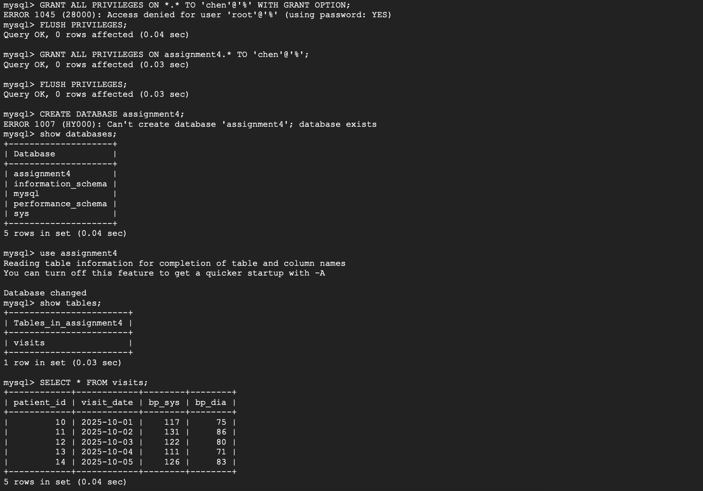

# HHA504_mysql_vm_vs_managed

---

Cloud chosen: Azure for Self-Hosted VM, GCP for Managed MySQL Instance
Region: Central Canada for Azure, Iowa for GCP

---

1. Azure VM — Self-Hosted MySQL

-	Launch a VM on Azure (Linux or Windows).
-	Install MySQL server on the VM.
-	Configure MySQL to listen on all interfaces (bind-address = 0.0.0.0).
-	Open port 3306 on both the OS firewall and Azure NSG.
-	Create MySQL user(s) and grant appropriate privileges.
-	Test connection locally first, then from an external machine.
-	Replace 'username', 'password', 'vm-public-ip', and 'database-name' accordingly.
- Use pymysql, mysqlclient, or similar MySQL connector.

---

2. GCP — Managed MySQL (Cloud SQL)

-	Go to GCP Console → SQL → Create Instance → MySQL.
-	Choose instance tier, storage, and MySQL version.
-	Set up admin username and password.
-	Configure network access:
-	Enable public IP or use private VPC connection.
-	Add allowed client IP(s) if using public IP.
-	Test connection using Cloud SQL Auth proxy (optional for local dev).
-	Same .env approach as Azure VM:
-	Load in Python with dotenv.

---

# Tips

-	For self-hosted Azure VM, make sure MySQL is listening on 0.0.0.0 and NSG/firewall rules are correct.
-	For GCP Managed, use the Cloud SQL Auth proxy for secure local development instead of exposing public IP.
-	Always avoid hardcoding credentials; .env or secret managers (Azure Key Vault / GCP Secret Manager) are safer for production.

---

# Screenshots
- Self-hosted

- Managed

